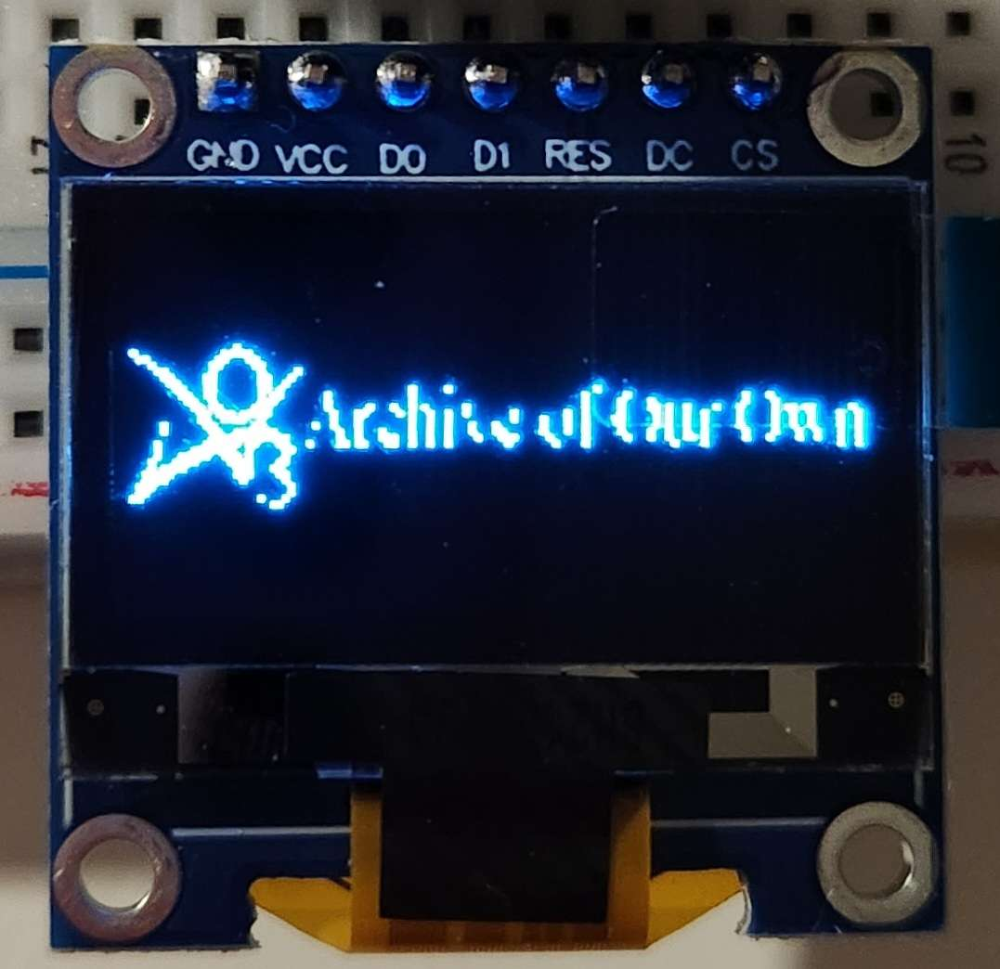

# arduinooo - An Arduino of Our Own

<!-- PROJECT LOGO -->
 

  

Very experimental, very jank transformative fanwork viewer (sourced from the Archive of Our Own) using the Arduino UNO and a 0.96" 128x64 graphical SSD1306 OLED Display. 

## What it does
Takes a work ID, then fetches the work from [AO3](https://archiveofourown.org/) and displays its metadata, the author's summary/notes and the work itself on the OLED screen. 
This content has been truncated into sections due to the Arduino's memory constraints, as well as limitations with the implementation of the vertical scrolling (if the text overflows, which it will, it will automatically scroll downwards) [^1]. 

To trigger movement to the next section, the switch is pressed. 

Basically, "Can it run Doom?" but for terminally online teenagers. 

<video src="https://github.com/phthallo/arduinooo/assets/84078890/86c35268-9c28-4ed9-9690-4a78c1adfe1a" height="100"/></video>

The answer is yes, it can!

(Better preview vid -> coming soon)

### Tools

* [Processing](https://processing.org/) and the [Processing Serial library](https://processing.org/reference/libraries/serial/index.html)
* [Arduino kit](https://www.arduino.cc/)
* [Jsoup library](https://jsoup.org/)
* [Adafruit SSD1306 libraries](https://learn.adafruit.com/monochrome-oled-breakouts/arduino-library-and-examples)

For this project, I used an Arduino UNO microcontroller set which was graciously provided for free by the [University of South Australia](https://study.unisa.edu.au/services-for-schools/experiences/curriculum-linked-education/gender-equity-in-stem/stem-girls-academy/). 
It makes use of the following components:

| Component | Quantity |
| --------- | -------- |
| Arduino UNO | 1 |
| OLED Screen | 1 | 
| Switch | 1 |
| Male-male connecting wires | 8 |
| Breadboard | 1 |

(Circuit design -> coming soon)

 
## Known Issues
* Jsoup only retrieves the first chapter of content 
* Punctuation like `”` and `–` do not render correctly. 
* Scrolling can go off the screen.

## Notes
I've never used Processing (or Java, which it is based on) before this. I've used C++ maybe once before (for another Arduino project), so everything is likely to be very unoptimised.

[^1]: The Adafruit SSD1306 library doesn't officially have support for vertical scrolling, but it does have support for horizontal and diagonal ones. My workaround is liable to errors, since it draws text in a negative region to imitate the scrolling effect.
